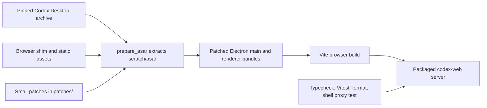
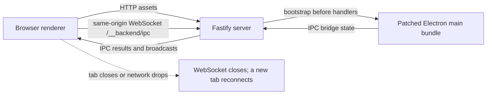
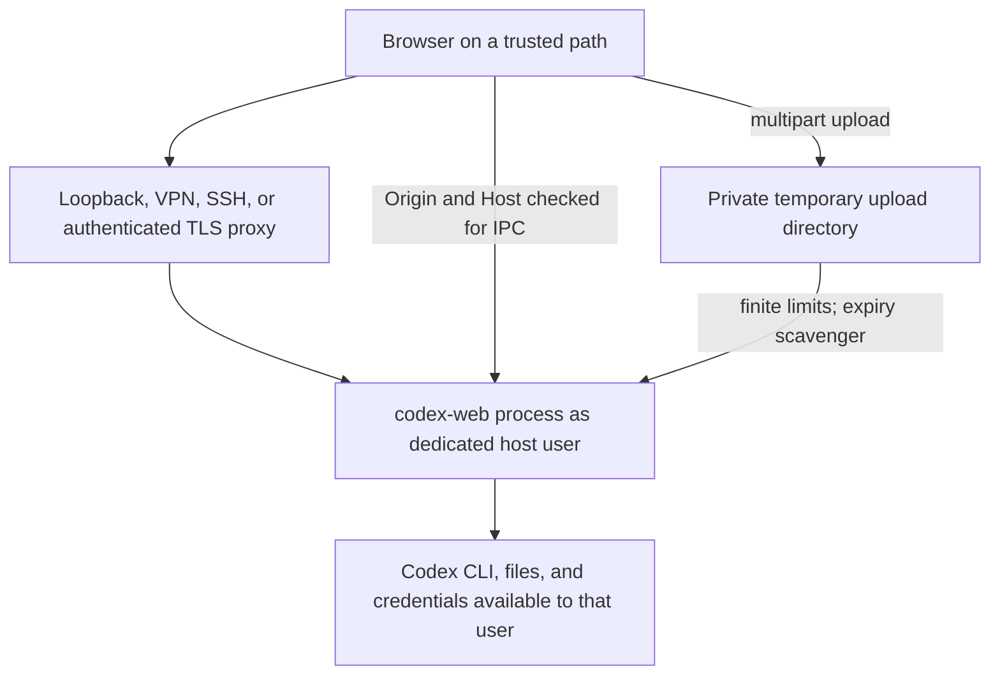

# Architecture

codex-web repackages a pinned Codex Desktop application, applies small patches,
and replaces its Electron boundaries with a browser-to-server bridge. The goal
is compatibility with the upstream app, not a new authorization system.

## Build and patch flow

`scripts/prepare_asar` unpacks the upstream archive into `scratch/asar`, copies
assets, and applies the reviewed patches. The build never redistributes the
original application source as patches; it carries only the narrow changes in
`patches/`. `src/browser/shim.ts` is bundled by Vite and stands in for the
renderer-facing Electron APIs.

## Runtime, readiness, and reconnect

`src/server/main.ts` serves the browser bundle and bridges the renderer’s
validated IPC envelope over `/__backend/ipc`. It boots the main application
before exposing handler-backed work. A very early invoke gets a deterministic
unavailable response instead of being silently dropped. A disconnected browser
can open a new WebSocket, but this is not persistence or authentication for the
old renderer session.

Only one browser tab holds the controller lease at a time. The browser sends a
page-lifetime identity before queued IPC; the first connected tab is active,
while secondaries can observe events and use a narrow, reviewed read-only
invoke allowlist. Every other invoke, send, postMessage, and message-port
mutation is denied unless that tab explicitly takes control. This arbitrates
tabs on one trusted host; it is not multi-user authentication or authorization.

Foreground notification forwarding is intentionally not implemented. The
pinned upstream Notification service uses actions, replies, callbacks, and
navigation metadata, so reducing it to title/body/tag would require parsing
undocumented private payloads and would silently lose behavior.

The normal runtime starts Codex through the server’s child lifecycle. The
optional `scripts/codex_remote_proxy` changes only that transport: it maps the
expected noninteractive stdio app-server protocol to an already-running Unix
socket using `websocat`. It must remain a private Unix socket; this mechanism is
not a TCP remote-control service.

## Trust boundaries

The default bind is `127.0.0.1`. `--lan` deliberately binds `0.0.0.0`, reports
only non-loopback IPv4 candidates that can reach that listener, and prints a
warning because network reach is host capability. Exact same-origin IPC is accepted. When a reverse proxy’s
external browser origin does not match the received Host, the operator must add
each exact HTTP(S) origin with repeatable `--allowed-origin`.

codex-web does not provide TLS, authentication, or authorization. Network
isolation, an SSH tunnel, a VPN, or an authenticated reverse proxy must provide
those controls. Run the process as a dedicated unprivileged user and scope its
filesystem and credential access accordingly.

Uploads have finite per-file, count, and aggregate limits and are stored in
metadata-marked private temporary directories. The scavenger only removes old,
recognizably generated upload directories; it leaves unexpected paths alone.

## Tests and change boundaries

- `src/server/main.test.ts` exercises origin checks, startup/readiness behavior,
  CLI defaults and conflicts, plus deterministic LAN candidate reporting.
- `src/server/uploads.test.ts` exercises bounded upload and retention behavior.
- `scripts/codex_remote_proxy.test.sh` uses a stub `websocat` to prove argument
  forwarding without making a network connection.
- Browser and IPC protocol tests protect the renderer shim boundary.
- `npm run check:compatibility` separately reverse-dry-runs every patch against
  the pinned extracted tree. Its patch target/hunk list is machine readable
  and the JSON report includes extracted-tree asset/startup budgets; this gate
  never prepares, rewrites, or downloads the proprietary archive.

When upstream changes, regenerate and review the smallest possible patches;
then run the full update gates in [UPGRADING.md](UPGRADING.md).
